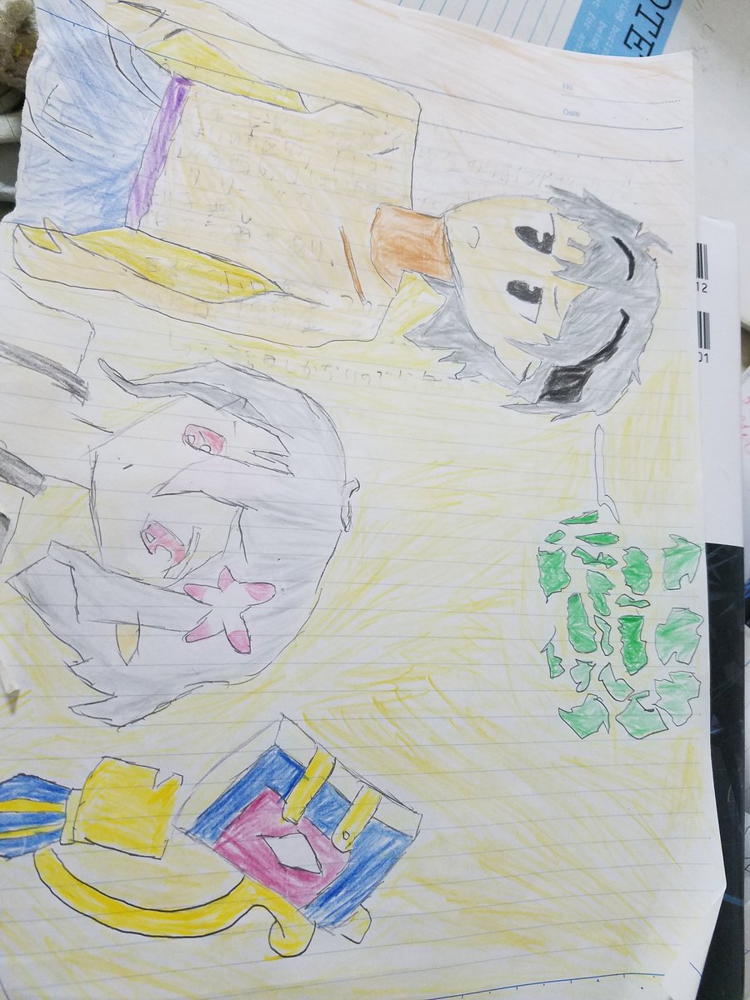
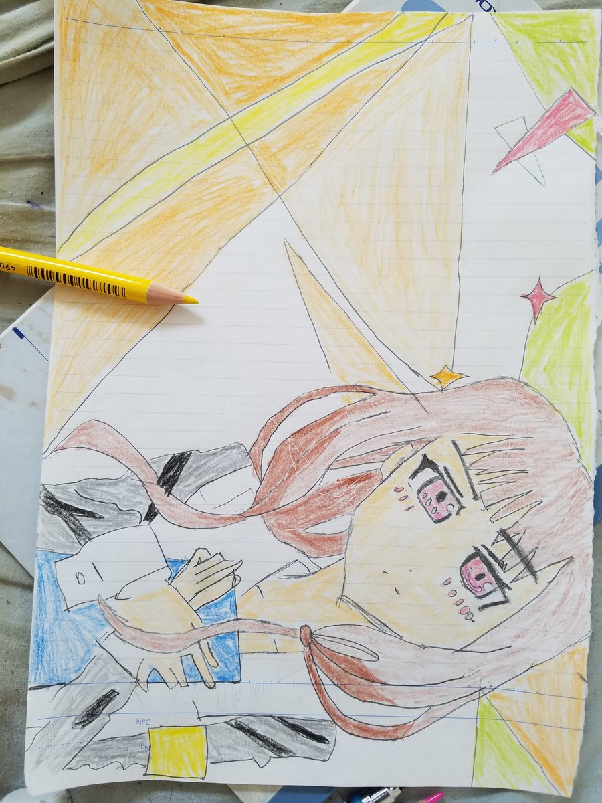
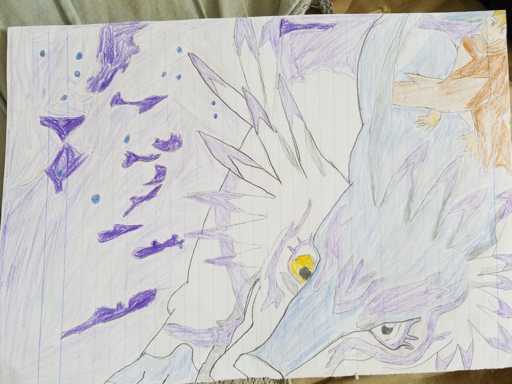
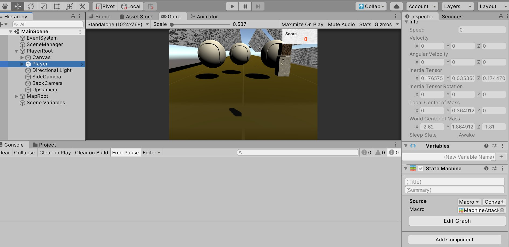
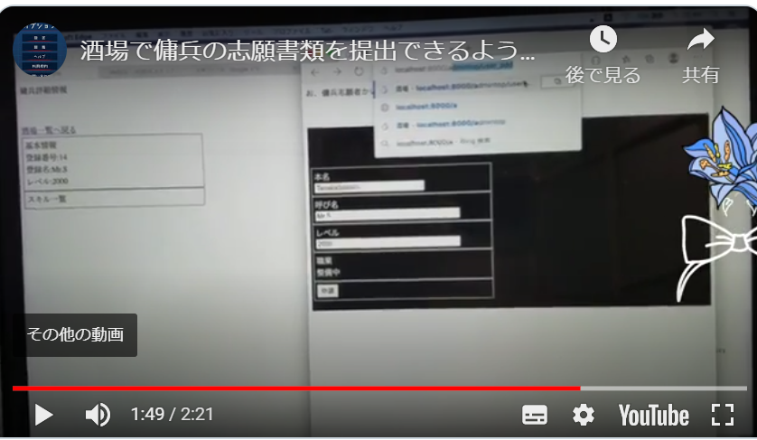
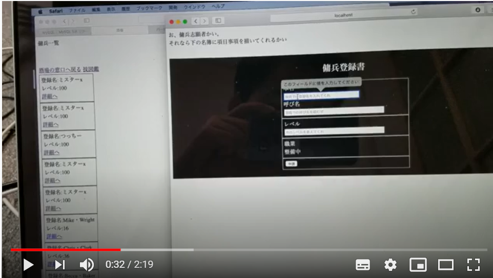

<!--
_backgroundColor: black
_color: white
-->

# 2020年8月２周　成果物

## @sakuriver

---
<!--
_backgroundColor: orange
paginate: true
-->

# 今週の趣味スプリントtips

   

---
<!--
_backgroundColor: white
-->

# 今週のお絵描きシリーズ1

アニメ第９話の模写

--- 

<!--
_backgroundColor: white
-->

# 今週のお絵描きシリーズ2

アニメ第９話の模写

--- 

<!--
_backgroundColor: white
-->

# 今週のお絵描きシリーズ3

アニメ第9話の模写

--- 

<!--
_backgroundColor: white
-->

# ゲーム開発コンテスト

Unityqweek

--- 

<!--
_backgroundColor: white
-->

# 今週の目標

・STGチャレンジのWebGlで載せられなかったもの

--- 

<!--
_backgroundColor: white
-->

# 最後に
最近は常駐でWeb系エンジニアをやっています
twitter は @sakuriver で活動中
github は https://github.com/sakuriver
成果物は趣味でやっている面白シリーズになります
趣味仲間募集中

---
<!--
_backgroundColor: white
-->

# 今週の常駐学習シリーズ1

フレームワーク学習
テンプレートエンジンを使っての登録画面~一覧実装

---
<!--
_backgroundColor: white
-->

# 今週の常駐学習シリーズ2

フレームワーク学習
テンプレートエンジンを使っての登録画面の登録修正

---
<!--
_backgroundColor: white
-->

# ありがとうございました

